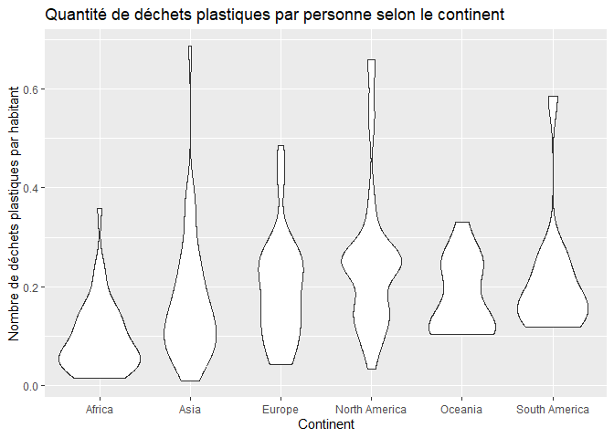

Lab 02 - Plastic waste
================
Aurélie Cyr
15/09/25

## Chargement des packages et des données

``` r
library(tidyverse) 
library(ggplot2)
```

``` r
plastic_waste <- read_csv("data/plastic-waste.csv")
```

Commençons par filtrer les données pour retirer le point représenté par
Trinité et Tobago (TTO) qui est un outlier.

``` r
plastic_waste <- plastic_waste %>%
  filter(plastic_waste_per_cap < 3.5)
```

``` r
glimpse(plastic_waste)
```

    ## Rows: 188
    ## Columns: 10
    ## $ code                             <chr> "ALB", "DZA", "AGO", "AIA", "ATG", "A…
    ## $ entity                           <chr> "Albania", "Algeria", "Angola", "Angu…
    ## $ continent                        <chr> "Europe", "Africa", "Africa", "North …
    ## $ year                             <dbl> 2010, 2010, 2010, 2010, 2010, 2010, 2…
    ## $ gdp_per_cap                      <dbl> 9927.182, 12870.603, 5897.683, NA, 19…
    ## $ plastic_waste_per_cap            <dbl> 0.069, 0.144, 0.062, 0.252, 0.660, 0.…
    ## $ mismanaged_plastic_waste_per_cap <dbl> 0.032, 0.086, 0.045, 0.010, 0.051, 0.…
    ## $ mismanaged_plastic_waste         <dbl> 29705, 520555, 62528, 52, 1253, 15777…
    ## $ coastal_pop                      <dbl> 2530533, 16556580, 3790041, 14561, 66…
    ## $ total_pop                        <dbl> 3204284, 35468208, 19081912, 15358, 8…

## Exercices

### Exercise 1

``` r
ggplot(plastic_waste, aes(x = plastic_waste_per_cap)) +
  geom_histogram(binwidth = 0.2) +
  facet_wrap(~continent) +
  labs(
    title = "Quantité de déchets plastiques par personne selon le continent",
    x = "Nombre de déchets plastiques par habitant", 
    y = "Nombre de pays")
```

<!-- -->

### Exercise 2

``` r
ggplot(plastic_waste, aes(x = plastic_waste_per_cap, fill = continent, color = continent)) +
  geom_density(alpha = 0.5) +
  labs(
    title = "Quantité de déchets plastiques par personne selon le continent" ,
    x = "Nombre de déchets plastiques par habitant",
    y = "Densité"
  )
```

<!-- -->

Les réglages de couleur sont dans le aes() car ils sont associés à une
variable en particulier, chaque variable doit avoir une couleur
différente. Au contraire, les réglages de transparence sont dans le
geom_density() car celui-ci s’applique à toutes les variables.

### Exercise 3

Boxplot:

``` r
ggplot(plastic_waste, aes( x = continent, y = plastic_waste_per_cap)) +
  geom_boxplot() +
  labs(
    title = "Quantité de déchets plastiques par personne selon le continent",
    x = "Continent",
    y = "Nombre de déchets plastiques par habitant"
  )
```

<!-- -->

Violin plot:

``` r
ggplot(plastic_waste, aes( x = continent, y = plastic_waste_per_cap)) +
  geom_violin() +
  labs(
    title = "Quantité de déchets plastiques par personne selon le continent",
    x = "Continent",
    y = "Nombre de déchets plastiques par habitant"
  )
```

<!-- -->

Le violin plot permet de voir la répartition exacte des données alors
que le box plot permet de voir la médiane et les valeurs extrème sans
voir la répartition des données.

### Exercise 4

``` r
ggplot(plastic_waste, aes(x = plastic_waste_per_cap, y = mismanaged_plastic_waste_per_cap, color = continent)) +
  geom_point() +
  labs(
    title = "Quantité de déchets par habitant vs quantité de déchets mal géré par habitant",
    x = "Quantité de déchets par habitant",
    y = "Quantité de déchets mal géré par habitant"
    )
```

<!-- -->

Quand la quantité de déchet par personne augmente, la quantité de
déchets mal gérés a tendance à augmenter.La relation n’est pas linéaire,
certains pays produisent beaucoup de déchets mais ont une bonne gestion
alors que certains pays produisent peu de déchets mais ont une mauvaise
gestion. Les continents avec une majorité de pays développés produisent
plus de déchets mais ont tendances à avoir une meilleure gestion alors
que, les continents avec une majorité de pays sous-développés ont une
moins grande production de déchets par personne mais ont une moins bonne
gestion.

### Exercise 5

``` r
ggplot(plastic_waste, aes(x = plastic_waste_per_cap, y = total_pop)) +
  geom_point() +
  labs(
    title = "Quantité de déchets par habitants vs Population totale",
    x = "Quantité de déchets par habitants",
    y = "Population totale"
  )
```

    ## Warning: Removed 10 rows containing missing values or values outside the scale range
    ## (`geom_point()`).

<!-- -->

``` r
ggplot(plastic_waste, aes(x = plastic_waste_per_cap, y = coastal_pop)) +
  geom_point() +
  labs(
    title = "Quantité de déchets par habitants vs Population côtière",
    x = "Quantité de déchets par habitants",
    y = "Population côtière"
  )
```

<!-- -->

Les pays avec une plus grande population côtière ont moins de déchets
par habitants que la majorité des pays.

## Conclusion

Recréez la visualisation:

``` r
plastic_waste_coastal <- plastic_waste %>% 
  mutate(coastal_pop_prop = coastal_pop / total_pop) %>%
  filter(plastic_waste_per_cap < 3)

ggplot(plastic_waste_coastal, aes(x = coastal_pop_prop,
                                  y = plastic_waste_per_cap, 
                                  color = continent)) +
  geom_point() +
  geom_smooth(se = TRUE,
              color = "black") +
  labs(
    title = "Quantité de déchets plastiques vs Proportion de la population côtière", 
    subtitle = "Selon le continent", 
    x = "Proportion de la population côtière (Coastal/total population", 
    y = "Nombre de déchets plastiques par habitant")
```

    ## `geom_smooth()` using method = 'loess' and formula = 'y ~ x'

    ## Warning: Removed 10 rows containing non-finite outside the scale range
    ## (`stat_smooth()`).

    ## Warning: Removed 10 rows containing missing values or values outside the scale range
    ## (`geom_point()`).

<!-- -->
